# Router Sync Architecture

## Overview

Router Sync is a Go-based service that manages internet providers and routing policies using NATS.io as the source of truth. It enables policy-based routing across multiple routers in a LAN environment by synchronizing configuration between NATS KV store and Linux routing tables.

## System Architecture

### High-Level Architecture

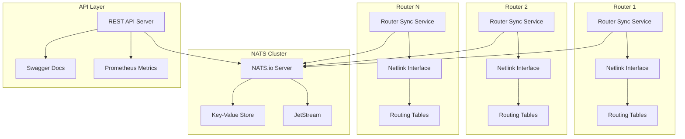

## Component Architecture

### Core Components

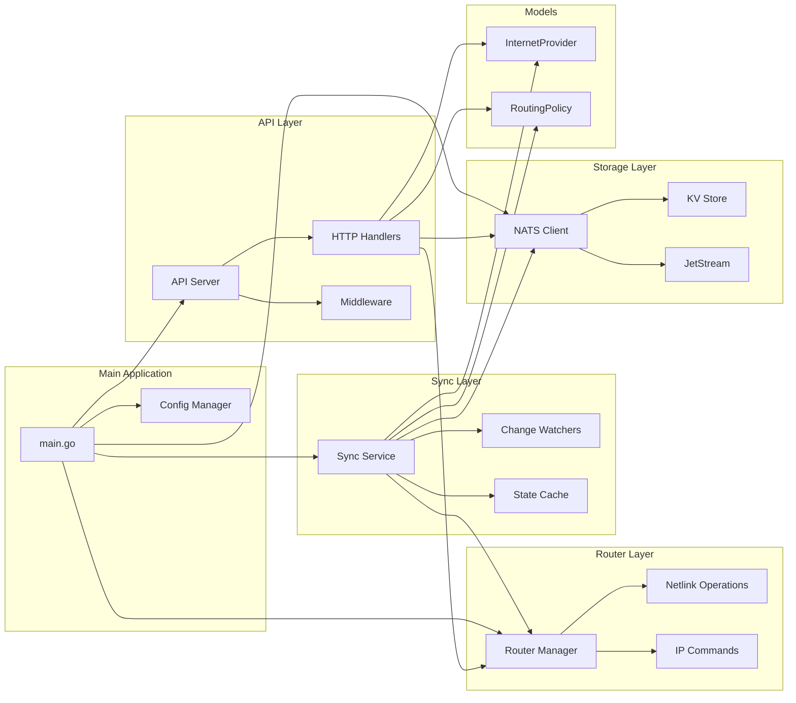

## Data Flow Architecture

### Service Startup Sequence

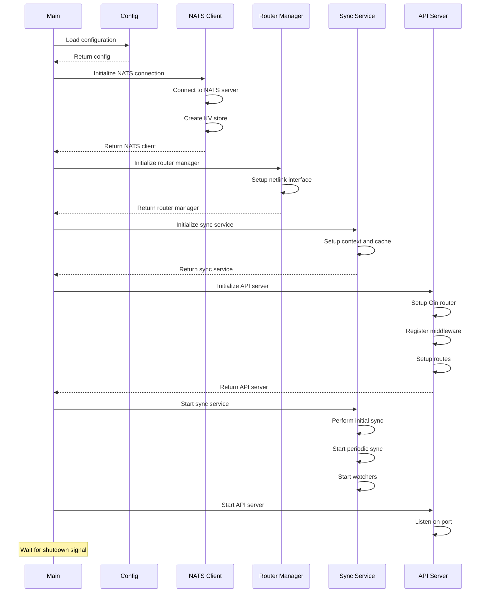

### Provider Management Sequence

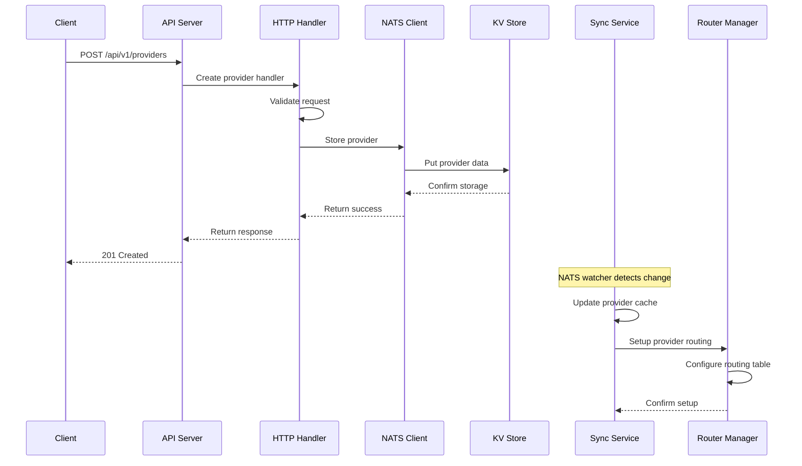

### Policy Management Sequence

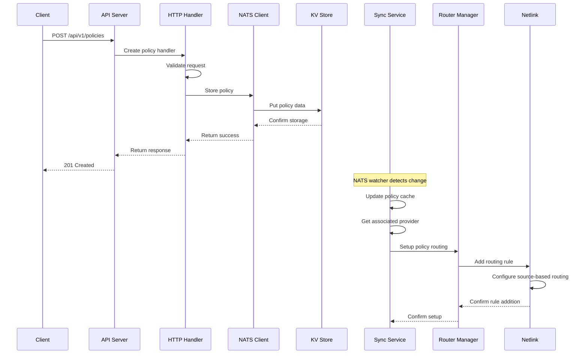

### Synchronization Sequence

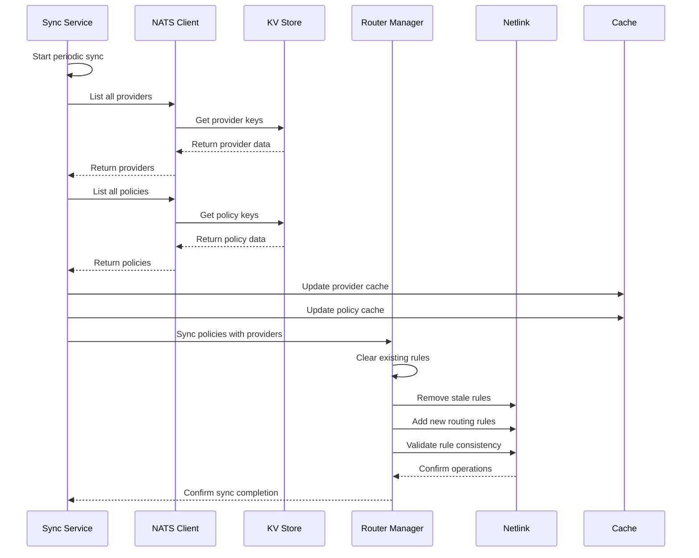

## Object Model

### Core Data Models

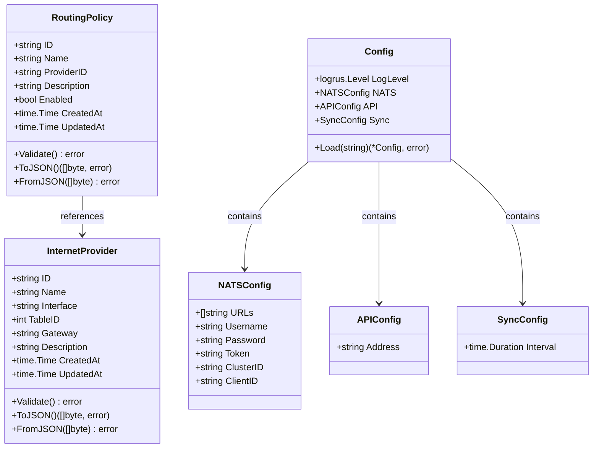

### Service Architecture

```mermaid
classDiagram
    class Server {
        +config.APIConfig config
        +nats.NATSClient natsClient
        +*router.Manager routerManager
        +*sync.Service syncService
        +*http.Server server
        +*prometheus.CounterVec httpRequestsTotal
        +*prometheus.HistogramVec httpRequestDuration
        +prometheus.Gauge providersTotal
        +prometheus.Gauge policiesTotal
        +string version
        +string buildTime
        +string gitCommit
        +NewServer() *Server
        +Start() error
        +Shutdown(context.Context) error
        +metricsMiddleware() gin.HandlerFunc
        +urlDecodeMiddleware() gin.HandlerFunc
    }
    
    class Service {
        +*nats.Client natsClient
        +*router.Manager routerManager
        +config.SyncConfig config
        +context.Context ctx
        +context.CancelFunc cancel
        +sync.WaitGroup wg
        +map[string]*models.InternetProvider providers
        +map[string]*models.RoutingPolicy policies
        +sync.RWMutex cacheMu
        +NewService() *Service
        +Start() error
        +Stop() error
        +performFullSync() error
        +watchProviders() error
        +watchPolicies() error
        +GetStats() map[string]interface{}
    }
    
    class Manager {
        +sync.RWMutex mu
        +NewManager() (*Manager, error)
        +SetupProvider(*models.InternetProvider) error
        +RemoveProvider(*models.InternetProvider) error
        +SetupPolicy(*models.RoutingPolicy, *models.InternetProvider) error
        +RemovePolicy(*models.RoutingPolicy, *models.InternetProvider) error
        +SyncProviders([]*models.InternetProvider) error
        +SyncPolicies([]*models.RoutingPolicy, []*models.InternetProvider) error
        +GetRoutingStats() (map[string]interface{}, error)
        +CleanupAllRules() error
    }
    
    class Client {
        +*nats.Conn conn
        +nats.JetStreamContext js
        +nats.KeyValue kv
        +NewClient(config.NATSConfig) (*Client, error)
        +Close()
        +StoreProvider(*models.InternetProvider) error
        +GetProvider(string) (*models.InternetProvider, error)
        +ListProviders() ([]*models.InternetProvider, error)
        +DeleteProvider(string) error
        +StorePolicy(*models.RoutingPolicy) error
        +GetPolicy(string) (*models.RoutingPolicy, error)
        +ListPolicies() ([]*models.RoutingPolicy, error)
        +DeletePolicy(string) error
        +WatchProviders(context.Context, func) error
        +WatchPolicies(context.Context, func) error
    }
    
    Server --> Service : uses
    Server --> Manager : uses
    Server --> Client : uses
    Service --> Manager : uses
    Service --> Client : uses
```

## API Architecture

### REST API Endpoints

```mermaid
graph TD
    subgraph "API Endpoints"
        HEALTH[GET /health]
        METRICS[GET /metrics]
        SWAGGER[GET /swagger/*]
        
        subgraph "Provider Management"
            LIST_PROVIDERS[GET /api/v1/providers]
            CREATE_PROVIDER[POST /api/v1/providers]
            GET_PROVIDER[GET /api/v1/providers/:id]
            UPDATE_PROVIDER[PUT /api/v1/providers/:id]
            DELETE_PROVIDER[DELETE /api/v1/providers/:id]
        end
        
        subgraph "Policy Management"
            LIST_POLICIES[GET /api/v1/policies]
            CREATE_POLICY[POST /api/v1/policies]
            GET_POLICY[GET /api/v1/policies/:id]
            UPDATE_POLICY[PUT /api/v1/policies/:id]
            DELETE_POLICY[DELETE /api/v1/policies/:id]
        end
        
        subgraph "System Operations"
            TRIGGER_SYNC[POST /api/v1/sync]
            GET_STATS[GET /api/v1/stats]
        end
    end
    
    HEALTH --> API_SERVER
    METRICS --> API_SERVER
    SWAGGER --> API_SERVER
    LIST_PROVIDERS --> API_SERVER
    CREATE_PROVIDER --> API_SERVER
    GET_PROVIDER --> API_SERVER
    UPDATE_PROVIDER --> API_SERVER
    DELETE_PROVIDER --> API_SERVER
    LIST_POLICIES --> API_SERVER
    CREATE_POLICY --> API_SERVER
    GET_POLICY --> API_SERVER
    UPDATE_POLICY --> API_SERVER
    DELETE_POLICY --> API_SERVER
    TRIGGER_SYNC --> API_SERVER
    GET_STATS --> API_SERVER
```

## Storage Architecture

### NATS Key-Value Store Structure

```mermaid
graph TD
    subgraph "NATS KV Store"
        subgraph "Providers"
            P1[providers.provider1]
            P2[providers.provider2]
            P3[providers.provider3]
        end
        
        subgraph "Policies"
            POL1[policies.192.168.1.100]
            POL2[policies.192.168.2.0_24]
            POL3[policies.10.0.0.0_16]
        end
    end
    
    subgraph "Data Format"
        PROVIDER_JSON[{"id":"provider1","name":"ISP1","interface":"eth0","table_id":100,"gateway":"192.168.1.1"}]
        POLICY_JSON[{"id":"192.168.1.100","name":"Policy1","provider_id":"provider1","enabled":true}]
    end
    
    P1 --> PROVIDER_JSON
    P2 --> PROVIDER_JSON
    P3 --> PROVIDER_JSON
    POL1 --> POLICY_JSON
    POL2 --> POLICY_JSON
    POL3 --> POLICY_JSON
```

## Routing Architecture

### Linux Routing Table Structure

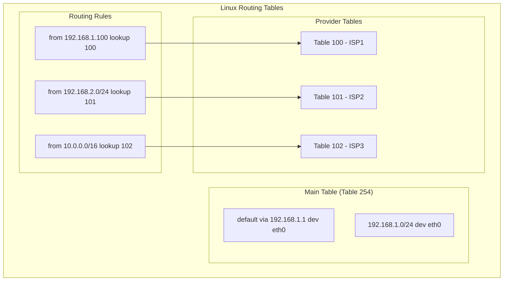

## Deployment Architecture

### Docker Deployment

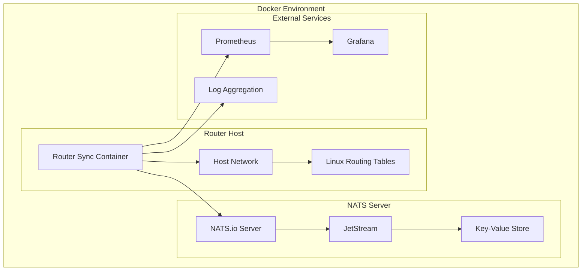

### Systemd Service Deployment

```mermaid
graph TD
    subgraph "Linux System"
        subgraph "Systemd"
            SERVICE[router-sync.service]
            USER[router-sync user]
        end
        
        subgraph "File System"
            BINARY[/usr/local/bin/router-sync]
            CONFIG[/etc/router-sync/config.yaml]
            LOGS[/var/log/router-sync]
        end
        
        subgraph "Network"
            NETLINK[Netlink Interface]
            ROUTING[Routing Tables]
        end
    end
    
    SERVICE --> USER
    USER --> BINARY
    BINARY --> CONFIG
    BINARY --> LOGS
    BINARY --> NETLINK
    NETLINK --> ROUTING
```

## Monitoring Architecture

### Metrics and Observability

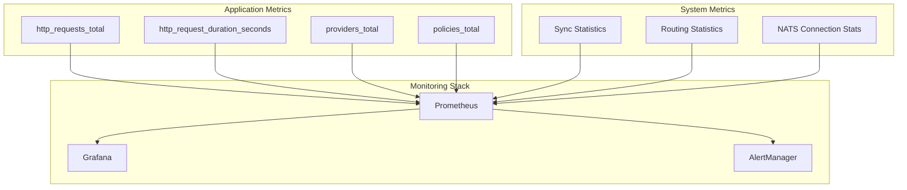

## Security Architecture

### Authentication and Authorization

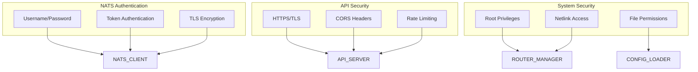

## Error Handling Architecture

### Error Flow and Recovery

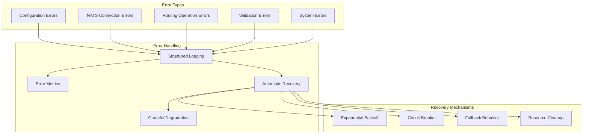

## Performance Architecture

### Scalability and Performance

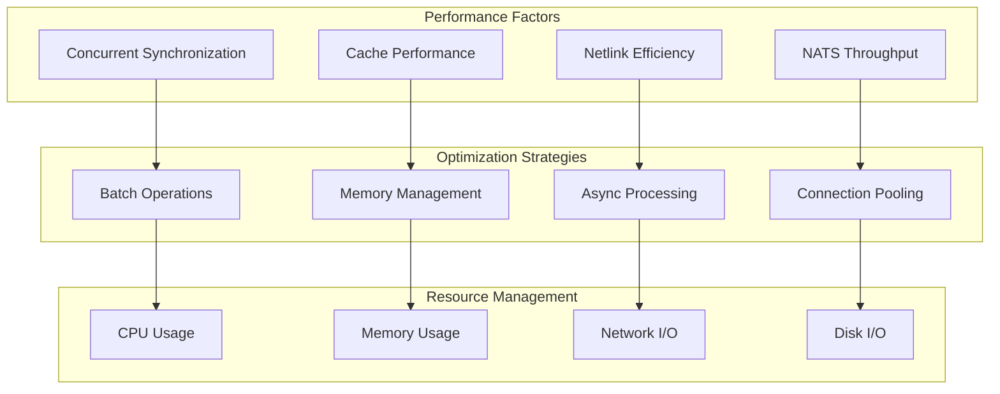

## Testing Architecture

### Testing Strategy

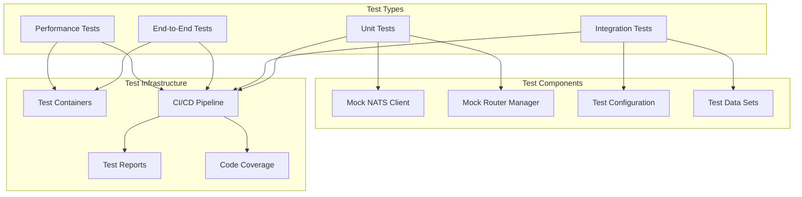

This architecture documentation provides a comprehensive view of the Router Sync service, including its components, data flow, deployment strategies, and operational considerations. The diagrams help visualize the relationships between different components and the overall system behavior. 