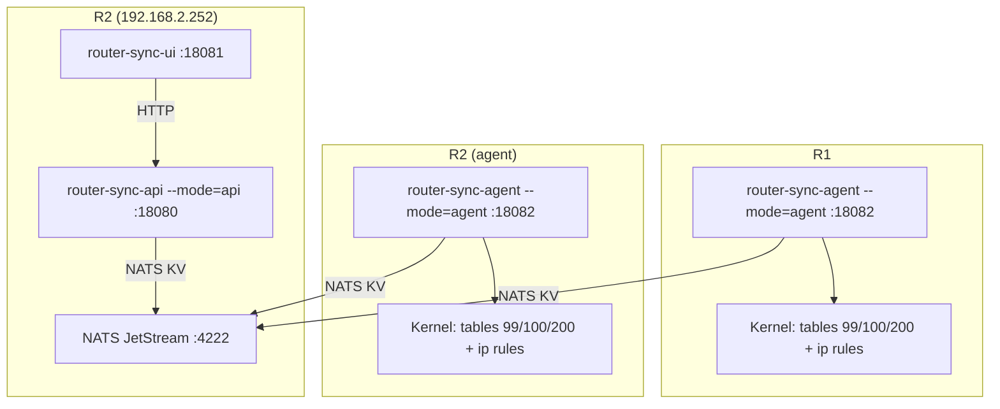
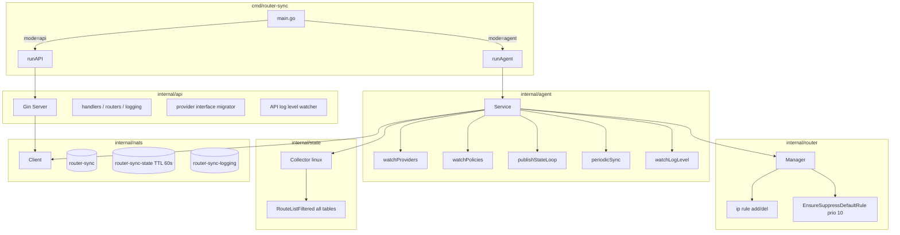
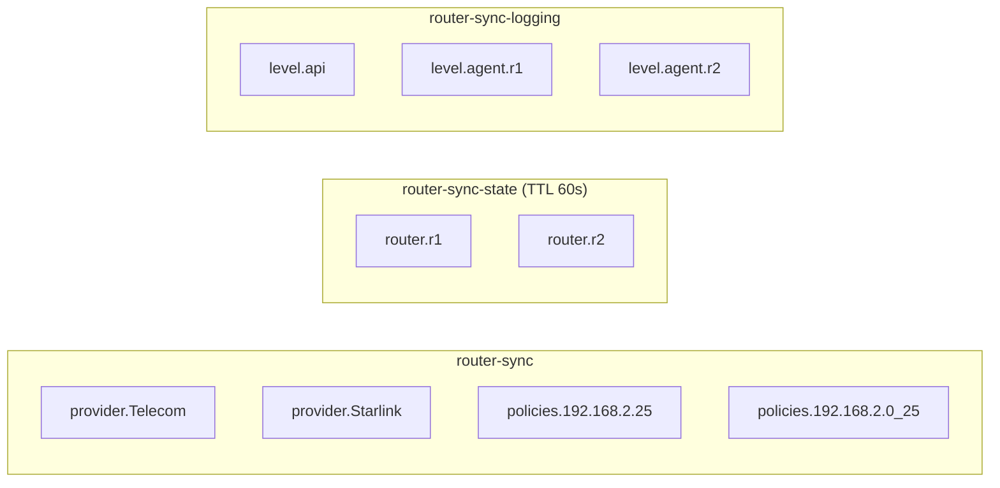
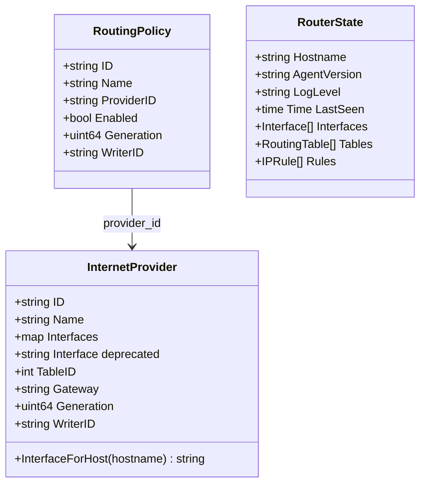
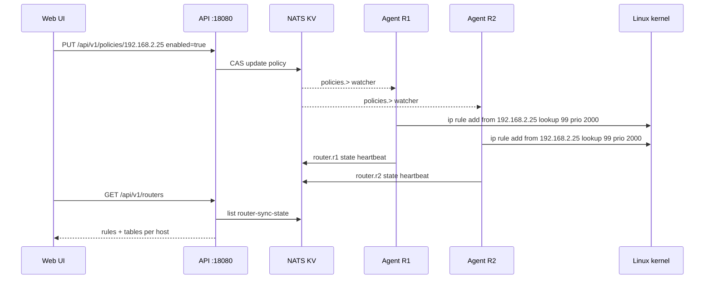

# Router Sync Architecture

## Overview

Router Sync is a split-binary system: one Go image runs either as a **central API** (NATS + HTTP only) or as a **per-router agent** (NET_ADMIN, applies kernel routing). NATS JetStream is the source of truth; the web UI is a separate container that calls the API.

Policy routing uses Linux **routing tables** (provisioned by netplan per uplink) plus **`ip rule`** entries (managed by agents per enabled policy).

## Deployment topology

| Component | Host | Privileges | Ports |
|-----------|------|------------|-------|
| NATS | R2 | — | 4222, 8222 (monitoring) |
| API | R2 | none | 18080 |
| UI | R2 | none | 18081 |
| Agent | R1, R2 | NET_ADMIN, host network | 18082 |

## Process architecture

## NATS storage layout

**Watchers** use subject patterns `providers.>` and `policies.>` (not `.*`) so keys containing dots (policy IDs as IPs/CIDRs) are delivered.

**Writes** use generation + `writer_id` for optimistic concurrency on providers and policies.

## Data models

## Policy application flow

## Linux routing model

### Tables (host network configuration)

Each uplink needs a dedicated routing table with a default route on the correct interface. You provision these outside Router Sync (netplan, NetworkManager, `ip route`, etc.). Example layout:

| Provider | Table ID | Interface (example) | Default route |
|----------|----------|---------------------|---------------|
| Telecom | 99 | enp1s0 | via 192.168.4.1 |
| Starlink | 100 | enp2s0 | via 192.168.3.1 |
| Tuenti | 200 | enp3s0 | via 192.168.150.1 |

Apply with `netplan apply` (or your distro's equivalent) on **each** router before expecting policies to work. Provider `table_id` in NATS must match these IDs.

### Rules (agent)

| Priority | Rule | Owner |
|----------|------|-------|
| 10 | `from all lookup main suppress_prefixlength 0` | Agent on start/stop |
| 2000–2032 | `from <src> lookup <table_id>` | Agent per enabled policy |

The **suppress-prefixlength** rule ensures traffic to local subnets uses the main table while only traffic matching the default route falls through to per-source policy rules.

### State collection

`internal/state/collector_linux.go` uses `netlink.RouteListFiltered` with `RT_FILTER_TABLE` and `RT_TABLE_UNSPEC` because `netlink.RouteList` only returns the **main** table. Without this, the UI would show a single table per router.

## API layer

The API server (`internal/api`) has **no** `router.Manager` dependency. It reads and writes NATS only.

| Route group | Responsibility |
|-------------|----------------|
| `/api/v1/providers` | CRUD; normalizes `interfaces` map; migrates legacy `interface` on startup |
| `/api/v1/policies` | CRUD |
| `/api/v1/routers` | List/get router state from `router-sync-state` |
| `/api/v1/logging` | Per-service log levels in `router-sync-logging` |
| `/api/v1/stats` | Aggregates providers, policies, router heartbeats |
| `/api/v1/sync` | No-op (agents sync continuously) |

CORS is enabled for the standalone UI origin.

## Agent layer

`internal/agent/service.go`:

1. `EnsureSuppressDefaultRule()` on start
2. Initial `performFullSync()` — `SyncProviders` + `SyncPolicies`
3. Goroutines: `periodicSync`, `watchProviders`, `watchPolicies`, `publishStateLoop`, `watchLogLevel`
4. On shutdown (via `main`): `CleanupAllRules()` then `RemoveSuppressDefaultRule()`

`internal/router/manager.go` applies policies with priorities 2000–2032, skips duplicate rules, clears conntrack when rules change, and validates one rule per source IP in the managed range.

**Note:** `SetupProvider` currently logs success but does not install routes into provider tables; table defaults come from netplan.

## Web UI

React + Vite + TanStack Query in `web/`. Served by nginx in `router-sync-ui` with runtime `ROUTER_SYNC_API_URL`.

| Page | Data source |
|------|-------------|
| Dashboard | `/health`, `/stats`, `/routers`, `/policies` (enabled-only allocation chart) |
| Routers | `/routers` — interfaces, all tables, rules |
| Devices / Policies | `/policies`, `/providers` |
| Providers | `/providers`, `/routers` (for per-host interface inputs) |
| Settings | `/logging/levels`, per-service `PUT` |

## Metrics

**API** (`:18080/metrics`): HTTP counters, `providers_total`, `policies_total`, `routers_known`, `router_state_age_seconds{hostname}`, `log_level_set_total`.

**Agent** (`:18082/metrics`): `agent_sync_*`, `agent_rules_total`, `agent_routes_total{table}`, `agent_state_publish_*`, `agent_conntrack_cleared_total`.

## Security

- NATS username/password (or token) — store in your secrets manager; mount or inject into each container's `config.yaml`
- API/UI exposed on LAN only (no auth on HTTP today)
- Agent requires NET_ADMIN and host network
- Restrict read access to config files (e.g. mode `0640`)

## Build and deploy

Single `Dockerfile` builds `./cmd/router-sync`. Typical layout:

| Component | Count | Notes |
|-----------|-------|-------|
| NATS JetStream | 1 | Central; reachable from API and all agents |
| API `--mode=api` | 1 | Published port `:18080`; no NET_ADMIN |
| Agent `--mode=agent` | 1 per router | `--network host`, `NET_ADMIN`, unique `agent.hostname` |
| UI (`web/`) | 1 | `ROUTER_SYNC_API_URL` → API; usually `:18081` |

Build the image with `make docker-build` or pull from [releases](https://github.com/fcastello/router-sync/releases). See [README.md — Production deployment](README.md#production-deployment) for netplan, Docker run examples, and ordering.

## Related docs

- [README.md](README.md) — quick start and API reference
- [BLOG.md](BLOG.md) — narrative overview
- [web/README.md](web/README.md) — UI development
