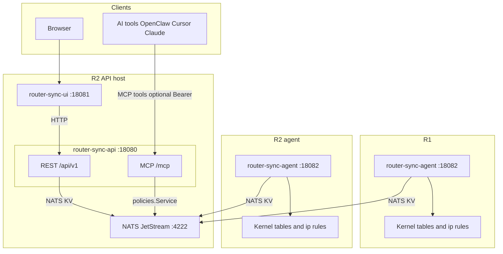
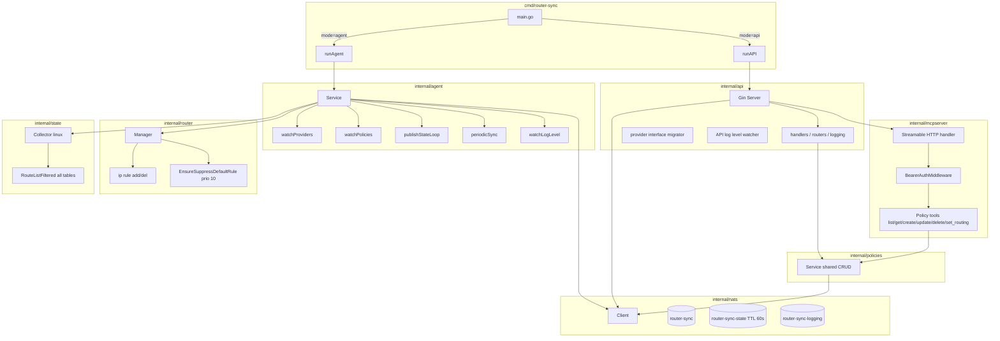
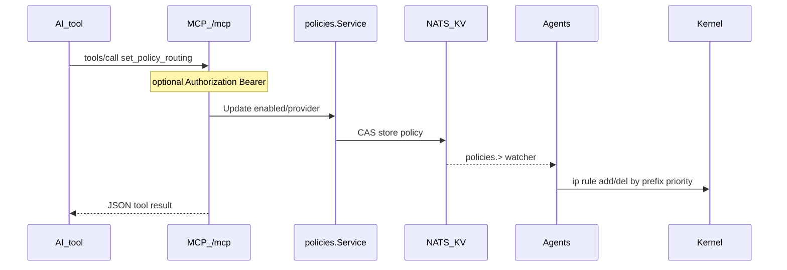
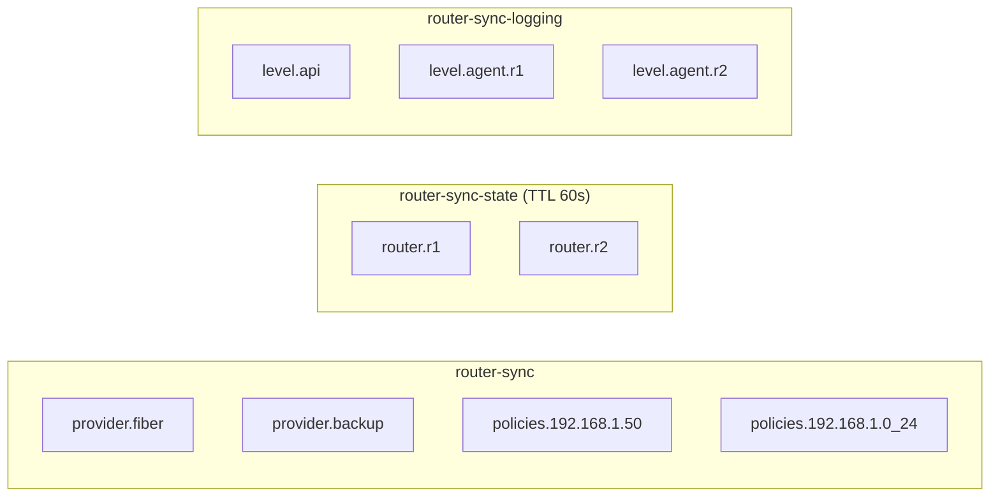
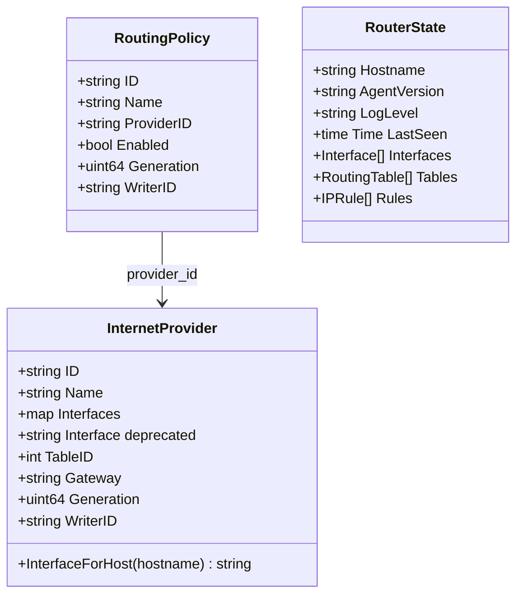
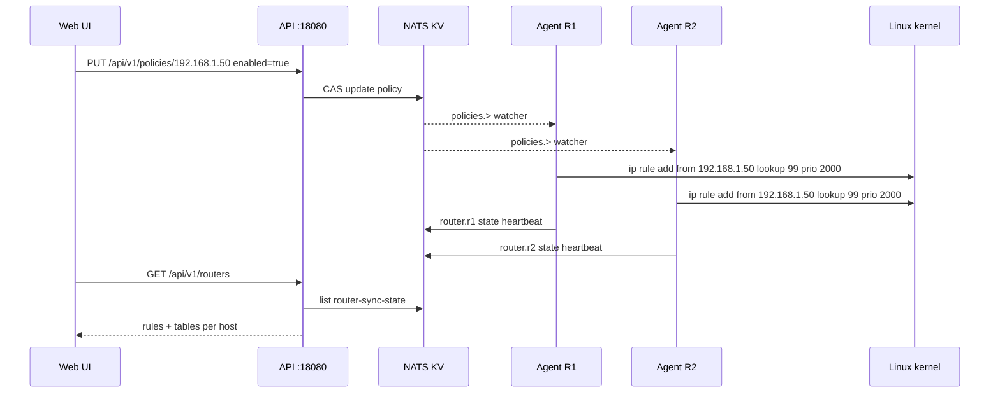

# Router Sync Architecture

## Overview

Router Sync is a split-binary system: one Go image runs either as a **central API** (NATS + HTTP only) or as a **per-router agent** (NET_ADMIN, applies kernel routing). NATS JetStream is the source of truth; the web UI is a separate container that calls the API.

The API can also expose a **policy-only MCP endpoint** (`/mcp` by default) so AI tools (OpenClaw, Cursor, Claude Desktop, custom agents) can list and change routing policies via the Model Context Protocol. MCP writes use the same `internal/policies` service as REST; agents still apply `ip rule` changes from NATS.

Policy routing uses Linux **routing tables** (provisioned by netplan per uplink) plus **`ip rule`** entries (managed by agents per enabled policy).

## Deployment topology

```mermaid
flowchart TB
  subgraph clients [Clients]
    Browser[Browser]
    AITools[AI tools OpenClaw Cursor Claude]
  end

  subgraph R2[R2 API host]
    UI[router-sync-ui :18081]
    subgraph apiproc [router-sync-api :18080]
      REST[REST /api/v1]
      MCP[MCP /mcp]
    end
    NATS[NATS JetStream :4222]
  end

  subgraph R1[R1]
    A1[router-sync-agent :18082]
    K1[Kernel tables and ip rules]
  end

  subgraph R2agent[R2 agent]
    A2[router-sync-agent :18082]
    K2[Kernel tables and ip rules]
  end

  Browser --> UI
  UI -->|HTTP| REST
  AITools -->|"MCP tools optional Bearer"| MCP
  REST -->|NATS KV| NATS
  MCP -->|policies.Service| NATS
  A1 -->|NATS KV| NATS
  A2 -->|NATS KV| NATS
  A1 --> K1
  A2 --> K2
```

| Component | Host | Privileges | Ports |
|-----------|------|------------|-------|
| NATS | R2 | — | 4222, 8222 (monitoring) |
| API (+ optional MCP `/mcp`) | R2 | none | 18080 |
| UI | R2 | none | 18081 |
| Agent | R1, R2 | NET_ADMIN, host network | 18082 |
| AI tools | anywhere that can reach the API | — | call MCP on `:18080/mcp` |

## Process architecture

```mermaid
graph TB
  subgraph binary["cmd/router-sync"]
    MAIN[main.go]
    MAIN -->|mode=api| RUNAPI[runAPI]
    MAIN -->|mode=agent| RUNAGENT[runAgent]
  end

  subgraph api_pkg["internal/api"]
    SERVER[Gin Server]
    HANDLERS[handlers / routers / logging]
    MIGRATOR[provider interface migrator]
    LOGWATCH[API log level watcher]
  end

  subgraph mcp_pkg["internal/mcpserver"]
    MCPH[Streamable HTTP handler]
    TOOLS["Policy tools list/get/create/update/delete/set_routing"]
    AUTH[BearerAuthMiddleware]
  end

  subgraph pol_pkg["internal/policies"]
    POLSVC[Service shared CRUD]
  end

  subgraph agent_pkg["internal/agent"]
    AGENT[Service]
    AGENT --> WATCH_P[watchProviders]
    AGENT --> WATCH_POL[watchPolicies]
    AGENT --> PUBLISH[publishStateLoop]
    AGENT --> SYNC[periodicSync]
    AGENT --> LOGW[watchLogLevel]
  end

  subgraph router_pkg["internal/router"]
    MGR[Manager]
    MGR --> RULES[ip rule add/del]
    MGR --> SUPPRESS[EnsureSuppressDefaultRule prio 10]
  end

  subgraph state_pkg["internal/state"]
    COLL[Collector linux]
    COLL --> NETLINK[RouteListFiltered all tables]
  end

  subgraph nats_pkg["internal/nats"]
    CLIENT[Client]
    KV1[(router-sync)]
    KV2[(router-sync-state TTL 60s)]
    KV3[(router-sync-logging)]
  end

  RUNAPI --> SERVER
  SERVER --> HANDLERS
  SERVER --> MCPH
  MCPH --> AUTH
  AUTH --> TOOLS
  TOOLS --> POLSVC
  HANDLERS --> POLSVC
  POLSVC --> CLIENT
  SERVER --> CLIENT
  RUNAGENT --> AGENT
  AGENT --> MGR
  AGENT --> COLL
  AGENT --> CLIENT
```

## MCP and AI tools

When `api.mcp.enabled` is true (default in sample config), Gin mounts a **stateless streamable HTTP** MCP server at `api.mcp.path` (default `/mcp`). Optional shared secret: `api.mcp.bearer_token` or `ROUTER_SYNC_MCP_TOKEN`.

| MCP tool | Effect |
|----------|--------|
| `list_policies` | List/filter policies (tag, enabled, provider_id) |
| `get_policy` | Fetch one policy by id (CIDR slash → underscore) |
| `create_policy` | Create source → provider policy |
| `update_policy` | Full replace of a policy |
| `delete_policy` | Remove a policy |
| `set_policy_routing` | Change `provider_id` and/or `enabled` only |

```mermaid
sequenceDiagram
  participant AI as AI_tool
  participant MCP as MCP_/mcp
  participant Pol as policies.Service
  participant NATS as NATS_KV
  participant Ag as Agents
  participant K as Kernel

  AI->>MCP: tools/call set_policy_routing
  Note over MCP: optional Authorization Bearer
  MCP->>Pol: Update enabled/provider
  Pol->>NATS: CAS store policy
  NATS-->>Ag: policies.> watcher
  Ag->>K: ip rule add/del by prefix priority
  MCP-->>AI: JSON tool result
```

AI clients only talk to MCP; they never need NET_ADMIN or direct router access. The same NATS policy keys drive both REST UI changes and MCP changes.

## NATS storage layout

```mermaid
graph LR
  subgraph bucket_core["router-sync"]
    P1["provider.fiber"]
    P2["provider.backup"]
    POL1["policies.192.168.1.50"]
    POL2["policies.192.168.1.0_24"]
  end

  subgraph bucket_state["router-sync-state (TTL 60s)"]
    R1["router.r1"]
    R2["router.r2"]
  end

  subgraph bucket_log["router-sync-logging"]
    L1["level.api"]
    L2["level.agent.r1"]
    L3["level.agent.r2"]
  end
```

**Watchers** use subject patterns `providers.>` and `policies.>` (not `.*`) so keys containing dots (policy IDs as IPs/CIDRs) are delivered.

**Writes** use generation + `writer_id` for optimistic concurrency on providers and policies.

## Data models

```mermaid
classDiagram
    class InternetProvider {
        +string ID
        +string Name
        +map Interfaces
        +string Interface deprecated
        +int TableID
        +string Gateway
        +uint64 Generation
        +string WriterID
        +InterfaceForHost(hostname) string
    }

    class RoutingPolicy {
        +string ID
        +string Name
        +string ProviderID
        +bool Enabled
        +uint64 Generation
        +string WriterID
    }

    class RouterState {
        +string Hostname
        +string AgentVersion
        +string LogLevel
        +time Time LastSeen
        +Interface[] Interfaces
        +RoutingTable[] Tables
        +IPRule[] Rules
    }

    RoutingPolicy --> InternetProvider : provider_id
```

## Policy application flow

```mermaid
sequenceDiagram
    participant UI as Web UI
    participant API as API :18080
    participant NATS as NATS KV
    participant A1 as Agent R1
    participant A2 as Agent R2
    participant K as Linux kernel

    UI->>API: PUT /api/v1/policies/192.168.1.50 enabled=true
    API->>NATS: CAS update policy
    NATS-->>A1: policies.> watcher
    NATS-->>A2: policies.> watcher
    A1->>K: ip rule add from 192.168.1.50 lookup 99 prio 2000
    A2->>K: ip rule add from 192.168.1.50 lookup 99 prio 2000
    A1->>NATS: router.r1 state heartbeat
    A2->>NATS: router.r2 state heartbeat
    UI->>API: GET /api/v1/routers
    API->>NATS: list router-sync-state
    API-->>UI: rules + tables per host
```

## Linux routing model

### Tables (host network configuration)

Each uplink needs a dedicated routing table with a default route on the correct interface. You provision these outside Router Sync (netplan, NetworkManager, `ip route`, etc.). Example layout:

| Provider | Table ID | Interface (example) | Default route |
|----------|----------|---------------------|---------------|
| fiber | 99 | eth0 | via 192.168.10.1 |
| backup | 100 | eth1 | via 192.168.20.1 |
| lte | 200 | eth2 | via 192.168.30.1 |

Apply with `netplan apply` (or your distro's equivalent) on **each** router before expecting policies to work. Provider `table_id` in NATS must match these IDs.

### Rules (agent)

| Priority | Rule | Owner |
|----------|------|-------|
| 10 | `from all lookup main suppress_prefixlength 0` | Agent on start/stop |
| 2000–2032 | `from <src> lookup <table_id>` | Agent per enabled policy |

Policy rule priority is derived from IPv4 prefix length so more specific sources are evaluated first (Linux: lower number wins):

| Prefix | Priority |
|--------|----------|
| /32 (host) | 2000 |
| /31 … /25 | 2001 … 2007 |
| /24 | 2008 |
| … | … |
| /8 | 2024 |
| /0 (widest) | 2032 |

Formula: `priority = 2000 + (32 − prefixLen)`. Example: a host `/32` and an overlapping `/24` both enabled → the host rule at `2000` wins. On each sync the agent rewrites a rule if its priority or table does not match.

The **suppress-prefixlength** rule ensures traffic to local subnets uses the main table while only traffic matching the default route falls through to per-source policy rules.

### State collection

`internal/state/collector_linux.go` uses `netlink.RouteListFiltered` with `RT_FILTER_TABLE` and `RT_TABLE_UNSPEC` because `netlink.RouteList` only returns the **main** table. Without this, the UI would show a single table per router.

## API layer

The API server (`internal/api`) has **no** `router.Manager` dependency. It reads and writes NATS only (via handlers and the shared `policies.Service`).

| Route group | Responsibility |
|-------------|----------------|
| `/api/v1/providers` | CRUD; normalizes `interfaces` map; migrates legacy `interface` on startup |
| `/api/v1/policies` | CRUD (same store as MCP tools) |
| `/api/v1/routers` | List/get router state from `router-sync-state` |
| `/api/v1/logging` | Per-service log levels in `router-sync-logging` |
| `/api/v1/stats` | Aggregates providers, policies, router heartbeats |
| `/api/v1/sync` | No-op (agents sync continuously) |
| `/mcp` | Optional MCP policy tools (streamable HTTP; `api.mcp.*`) |

CORS allows `Authorization` and `Mcp-Session-Id` for UI and MCP clients.

## Agent layer

`internal/agent/service.go`:

1. `EnsureSuppressDefaultRule()` on start
2. Initial `performFullSync()` — `SyncProviders` + `SyncPolicies`
3. Goroutines: `periodicSync`, `watchProviders`, `watchPolicies`, `publishStateLoop`, `watchLogLevel`
4. On shutdown (via `main`): `CleanupAllRules()` then `RemoveSuppressDefaultRule()`

`internal/router/manager.go` applies policies with prefix-length priorities (2000–2032; `/32` → 2000 … `/8` → 2024), reconciles stale priority/table on sync, deletes by `from <cidr>` (safe when multiple policies share a prefix length), clears conntrack when rules change, and validates one rule per source in the managed range.

**Note:** `SetupProvider` currently logs success but does not install routes into provider tables; table defaults come from netplan.

## Web UI

React + Vite + TanStack Query in `web/`. Served by nginx in `router-sync-ui` with runtime `ROUTER_SYNC_API_URL`.

| Page | Data source |
|------|-------------|
| Dashboard | `/health`, `/stats`, `/routers`, `/policies` (enabled-only allocation chart) |
| Routers | `/routers` — interfaces, all tables, rules |
| Devices / Policies | `/policies`, `/providers` |
| Providers | `/providers`, `/routers` (for per-host interface inputs) |
| Settings | `/logging/levels`, per-service `PUT` |

## Metrics

**API** (`:18080/metrics`): HTTP counters, `providers_total`, `policies_total`, `routers_known`, `router_state_age_seconds{hostname}`, `log_level_set_total`.

**Agent** (`:18082/metrics`): `agent_sync_*`, `agent_rules_total`, `agent_routes_total{table}`, `agent_state_publish_*`, `agent_conntrack_cleared_total`.

## Security

- NATS username/password (or token) — store in your secrets manager; mount or inject into each container's `config.yaml`
- API/UI exposed on LAN only (REST has no auth today)
- MCP optional bearer token (`ROUTER_SYNC_MCP_TOKEN` / `api.mcp.bearer_token`) — use when AI tools reach the API
- Agent requires NET_ADMIN and host network
- Restrict read access to config files (e.g. mode `0640`)

## Build and deploy

Single `Dockerfile` builds `./cmd/router-sync`. Typical layout:

| Component | Count | Notes |
|-----------|-------|-------|
| NATS JetStream | 1 | Central; reachable from API and all agents |
| API `--mode=api` | 1 | Published port `:18080`; optional MCP at `/mcp`; no NET_ADMIN |
| Agent `--mode=agent` | 1 per router | `--network host`, `NET_ADMIN`, unique `agent.hostname` |
| UI (`web/`) | 1 | `ROUTER_SYNC_API_URL` → API; usually `:18081` |
| AI tools | 0+ | MCP client URL `http://<api-host>:18080/mcp` |

Build the image with `make docker-build` or pull from [releases](https://github.com/fcastello/router-sync/releases). See [README.md — Production deployment](README.md#production-deployment) for netplan, Docker run examples, and ordering.

## Related docs

- [README.md](README.md) — quick start and API reference
- [BLOG.md](BLOG.md) — narrative overview
- [web/README.md](web/README.md) — UI development
- [docs/MCP.md](docs/MCP.md) — MCP client setup (if present in your checkout)
